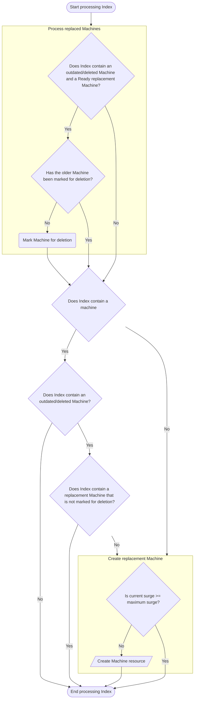
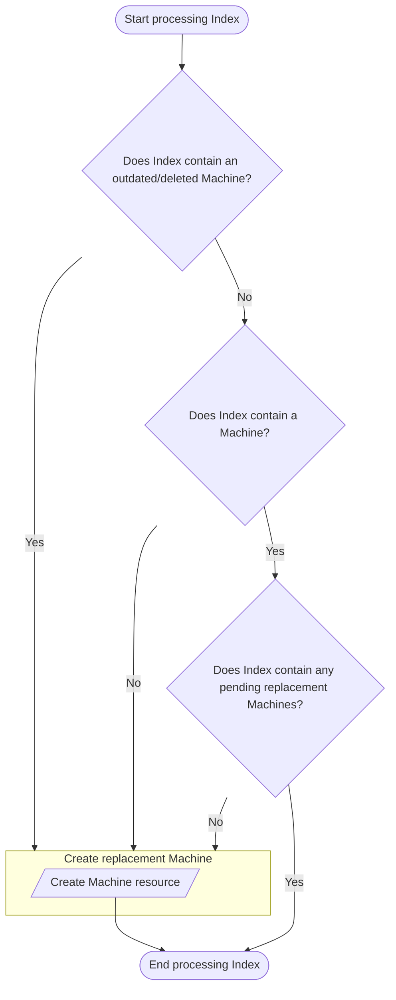

# Update strategies

This document explains the behaviour of the control plane machine set update strategies.
The update strategies are engaged when the control plane machine set identifies that a machine it is managing is in
need of replacement.

The machine will need replacement either: because it was deleted, by a user or machine health check; or because the
specification has changed, for example, to vertically scale the control plane machines.

## RollingUpdate

The `RollingUpdate` strategy is similar in concept to a deployment rolling update strategy. It is intended as an
automated way to replace the machines when there is some update to the configuration. For example, when the instance
size is changed to increase the control plane capacity.

When the control plane machine set detects that a machine is in need of replacement, it will create a replacement
machine for that index.
Once the replacement machine is ready (synonymous with the `Running` phase in Machine API), the control plane machine
set will delete the old machine.
This deletion will then signal to the etcd operator to move the etcd member from the old machine to the new machine.

Once the etcd operator has moved the etcd member, it will remove the machine deletion hook from the machine which will
then allow the machine to be removed from the cluster by the machine controller.

The control plane machine set, on each reconcile, iterates through the machine indexes applying this logic.
Where the control plane machine set differs from a deployment is that the `maxSurge` concept of the deployment, which
allows over-provisioning of the workload during an update, is limited to `1` in the control plane machine set.
This has the effect of limiting the replacement logic to only operating on a single index at any one time.

## OnDelete

The `OnDelete` strategy is similar in concept to a statefulset on-delete strategy. It is intended as a manually
triggered way to replace the machines when there is some update to the configuration.
This means it can be used to slowly roll out updates to the control plane machines.

Where the `OnDelete` strategy differs from the `RollingUpdate` strategy is that it will not automatically create
the new machine when it detects that that an update is required.
Instead it waits for the user to signal a desire for the replacement by deleting the old machine, for example by using
`oc delete machine -n openshift-machine-api <machine-name>`.

The `OnDelete` strategy also does not observe any concept of `maxSurge` and will create replacements for all indexes
should they be deleted simultaneously.

Note: In this mode, the etcd operator will wait for the replacement machine to become ready before allowing the old
machine to be removed. The etcd quorum is still protected.

